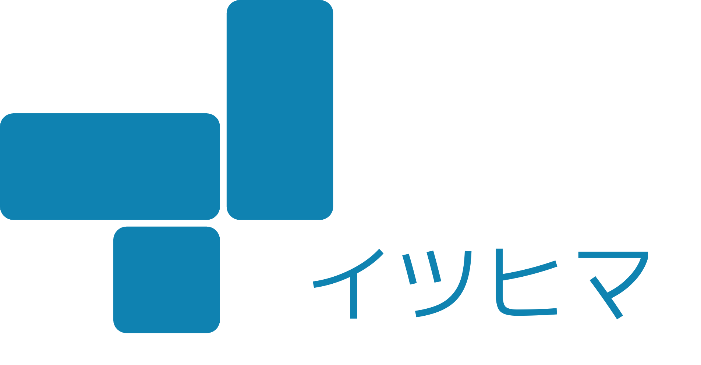

# イツヒマ



## 概要

とりあえずみんなの空いている時間を訊いてから、何を何時間やるか決めたい。そんな仲間うちでの日程調整に最適なツールです。

## AI 連携（MCP）

ChatGPT / Claude / Claude Code からイベントの確認や日程の提出ができる。
接続方法とツールの仕様は [`docs/mcp.md`](./docs/mcp.md) を参照。

## 開発

### 要件

- Node.js
- npm
- Docker (開発用 DB のみに使用)

### セットアップ

依存関係のインストール

```sh
npm ci
```

`server/.env.sample` をコピーして `server/.env` を作成

`client/.env.local.sample` をコピーして `client/.env.local` を作成

開発用データベースの起動

```sh
docker compose up
```

スキーマの反映

```sh
cd server
npx prisma migrate dev
```

### 起動

開発用データベースの起動

```sh
docker compose up
```

サーバー側とクライアント側をそれぞれ起動

```sh
npm run dev:server
```

```sh
npm run dev:client
```

cloudflare functions が必要な場合

```sh
npm run dev:functions
```

http://localhost:5173 にアクセスします。


### MCP サーバー

ローカルで動かす場合、`/mcp` は `npm run dev:server` に同居している。
連携コードは http://localhost:5173/settings/mcp から発行できる。
stdio ブリッジをローカルの API に向けるには `ITSUHIMA_API=http://localhost:3000` を指定する。

詳細は [`docs/mcp.md`](./docs/mcp.md) を参照。

### コードスタイル

コードのリント・フォーマット

```sh
npm run check
npm run fix
```
